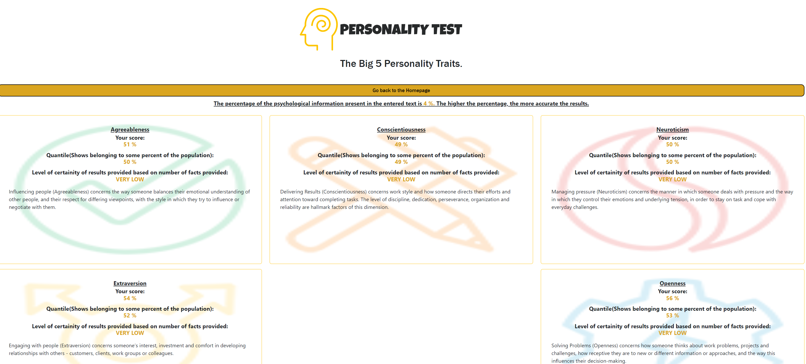

# PersonalityTest
[](https://github.com/dwyl/esta/issues)

> This is a project built on django and react js. It helps one determine their traits based on questionnaires or a brief description of themselves. It uses the sentino API.


# Requirements (Prerequisites)
Tools and packages required to successfully install this project.
* Python 3.10.7 and up [Install](https://www.python.org/downloads/)
* Node.js 18.9.0 and up [Install](https://nodejs.org/en/download/)

# Installation
Clone this project in your local machine. Create a virtual enviroment and enter it.

Run the following commands in the virtual environment to install all requirements of this project.

`pip install -r requirements.txt`

`npm install`

Create a `.env` file in your projects root folder.
```
    SECRET_KEY = YOUR_SECRET_KEY
    DEBUG = A boolean value
    ALLOWED_HOSTS= A list of comma separated hosts to allow.
    SENTINO_TOKEN = YOUR_SENTINO_TOKEN
```
To request an API token from sentino, please refer to [the sentino website.](https://sentino.org/api/)

Ensure you are in the project's root folder when you run the following command.

`python manage.py runserver`

# Usage example

- Choose one of the two options at the homepage.

- When you choose "Write something about Yourself", you will fill a brief description of yourself according to the instructions given.


- After you submit, you will get an analysis on your personality according to the big 5 traits.



- When you choose "Take a Questionnaire", you will have to choose the number of questions.


- You have to choose one of the seven answers in the response to a given question.


- After you finish all questions, you will get an analysis on your personality according to the neo personality inventory.


# Project Structure

The django project has one app.

* quiz - Contains all the personality test related information.

Other folders:

- assets - Contains react components.
- personality - Contains configurations for the django project.
- screenshots - Contain screenshots of the application.
- static - Contains static files used by the django project.
- staticfiles - Contains a collection of all the static files used by the project after using the command, `python manage.py collectstatic`
- templates - Contain templates used by the django project.

# Built With
1. [Django](https://djangoproject.com/) - The Django framework
2. [React js](https://reactjs.org/) - React JS

# Author

The author of this project is Richard Odhiambo.

 You can find me here at:
[Github](https://github.com/o-richard)

## How to Contribute
Pull requests are welcome. For major changes, please open an issue first to discuss what you would like to change. If you'd like to contribute, please fork the repository and make changes as you'd like. Pull requests are warmly welcome.

Steps to contribute:
1. Fork this repository.
2. Create your feature branch.
3. Commit your changes.
4. Push to the branch.
5. Create a new Pull Request.

# License

This project is licensed under the MIT License.
